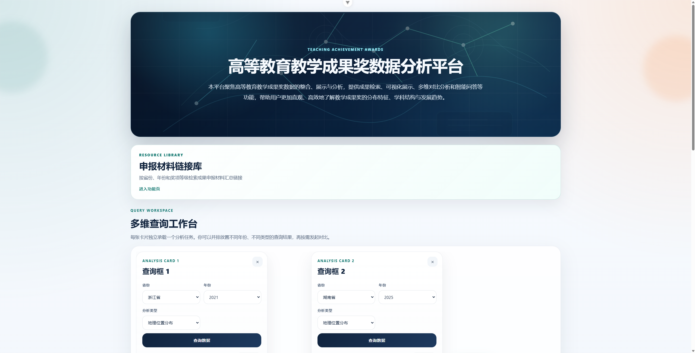

# Teaching Awards Data Platform

高等教育教学成果奖数据分析与智能问答平台。项目整合多省教学成果奖数据，提供多维统计分析、图表展示、结果对比、申报材料链接检索和基于当前查询结果的智能问答能力。

## Preview



## Features

* 省份、年份和分析类型的多维查询

* 获奖单位、奖项等级、学科类型、学校层次、完成模式、合作情况等基础分析

* 多张查询卡片并排展示和同类型结果对比

* 浙江省研究主题表和词云图展示

* 申报材料链接库查询

* 基于后端数据摘要的智能问答

## Tech Stack

* Frontend: Vue 3, Vite, Element Plus, Chart.js

* Backend: Flask, MySQL, DeepSeek API

* Data pipeline: Python, openpyxl, OCR/PDF extraction scripts

* Database: MySQL

## Project Structure

```text
.
├─ frontend/              # Vue frontend application
├─ backend/               # Flask API service and backend config
├─ database/schema/       # MySQL table creation scripts
├─ data-pipeline/         # Data extraction, cleaning, enrichment, import scripts
├─ data/processed/        # Processed sample/standardized data committed to Git
├─ docs/                  # Project documents and province onboarding notes
├─ .env.example           # Environment variable template
├─ .gitignore             # Files excluded from Git
├─ package.json           # Root npm helper scripts
└─ README.md
```

The following local folders are intentionally not committed:

* `frontend/node_modules/`

* `frontend/dist/`

* `data/raw/`

* `data/interim/`

* `data-pipeline/work/`

* `runtime/`

* `.env`

## Local Setup

### 1. Install frontend dependencies

Run from the project root:

```powershell
npm run install:frontend
```

### 2. Start the frontend

```powershell
npm run dev
```

The frontend runs at:

```text
http://127.0.0.1:5173/
```

You can also start it from the frontend folder:

```powershell
cd frontend
npm run dev
```

### 3. Start the backend

Open another terminal:

```powershell
cd backend
$env:DEEPSEEK_API_KEY="your_deepseek_api_key"
python app.py
```

The backend runs at:

```text
http://127.0.0.1:5000/
```

For local development, database defaults are defined in `backend/app.py`. For deployment or shared environments, use environment variables instead.

## Environment Variables

Copy `.env.example` as a reference. Do not commit real secrets.

```text
DB_HOST=localhost
DB_USER=root
DB_PASSWORD=000000
DB_NAME=teaching_awards

DEEPSEEK_API_KEY=your_deepseek_api_key_here
DEEPSEEK_BASE_URL=https://api.deepseek.com
DEEPSEEK_MODEL=deepseek-chat
```

Only `DEEPSEEK_API_KEY` is required for the intelligent Q&A module when using the default DeepSeek API endpoint and model.

## Database

Table creation scripts are stored in `database/schema/`:

* `001_create_awards_master.sql`: unified awards master table

* `002_create_material_link_library.sql`: application material link library

* `003_create_wordcloud_images.sql`: word cloud image storage

Processed data can be imported with scripts under `data-pipeline/importers/`.

## Data Pipeline

`data-pipeline/` contains scripts for:

* extracting award lists from PDFs, Word documents and Excel files

* repairing parsing issues

* enriching school metadata

* auditing cleaned data

* importing standardized data into MySQL

Province onboarding notes are maintained in `docs/PROVINCE_ONBOARDING.md`.

## Security Notes

* Do not commit `.env` or real API keys.

* Do not commit raw source files unless copyright and data-sharing scope are confirmed.

* Keep the repository private until the project is ready for public release.

## Current Scope

The current platform focuses on basic analysis and trial use. Advanced capabilities such as theme tables and word clouds are not fully generalized for all provinces yet.
